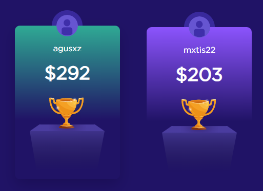

# Getting Started with Styled Components

Antes de comenzar con este workshop deberemos tener lo siguiente instalado:

- VSCode: [Descarga de VSCode](https://code.visualstudio.com/)
- NodeJS: [Link de descarga de NodeJS](https://nodejs.org/download/release/v16.20.2/)
- El repositorio clonado en nuestra maquina: [URL del Repositorio](https://github.com/Miguel22247/workshop-hbtn-styled-components)
- Extension de Styled Components (opcional): [Link de la extension](https://marketplace.visualstudio.com/items?itemName=styled-components.vscode-styled-components)

## Proximos pasos

Tras tener clonado nuestro repositorio vamos a proceder a instalar todas las librerias que utilizaremos en el workshop, para esto. Utilizaremos el comando `npm install` y para iniciar nuestro proyecto en local utilizaremos `npm start`

### La idea del workshop

La idea de este workshop es que recreemos este componente de React utilizando Styled components

---

#### Informacion sobre el texto del componente

- font: Gotham
- font-size del nickname: 16px
- font-size del prize pool: 36px;
- font-weight: bold;
- color: #ffffff (white)

#### Info sobre el container del componente

##### General
- width: 205px
- height: 300px
- border-radius: 10px
- background: gradients dinamicos, #201366

##### Hover
- margin-top: -5px;
- cursor: pointer;
- box-shadow: 0px 12px 30px 0px rgba(26, 14, 86, 1);
- transition: all 800ms cubic-bezier(0.19, 1, 0.22, 1);

#### Avatar

- El componente Avatar sera suministrado y se encuentra en la carpeta `src/components/global`
- width: 60px;
- height: 60px;
- border-radius: 50%;
- background: linear-gradient(to bottom, rgba(63, 47, 170, 0.8) 0%, rgba(63, 47, 170, 0.8) 50%, rgba(0, 0, 0, 0) 50%, rgba(0, 0, 0, 0) 100%)
- tamaño del Avatar va a ser de 42px
